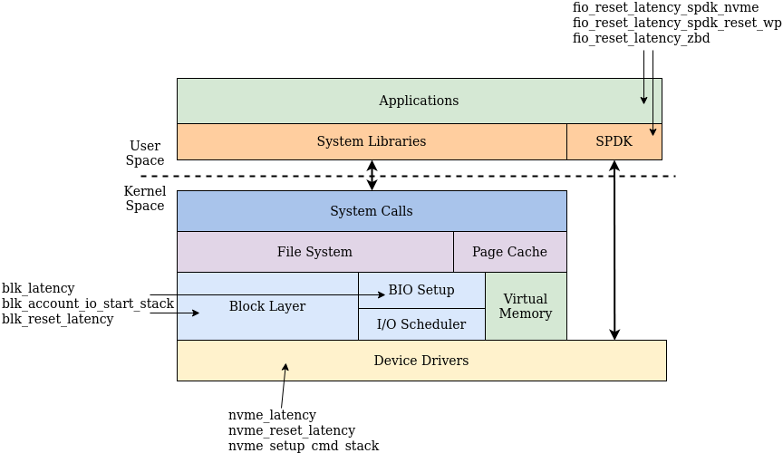

# BPF-Stosys-scripts 

A collection of BPF scripts to break down performance aspects of various layers
in storage systems software stack.

## Running

```bash
sudo bpftrace ./[script path]
```

To direct the BPF output containing the resulting maps, we can provide an
output file in the bpftrace command.

```bash
sudo bpftrace ./[script path] -o data.dat
```

## Available Scripts

We aim to focus on scripts for the storage stack, and anything that might be in
between, or give us insight into system functionality. All available scripts, for
their respective software layer, are shown in the figure below.



## Contributing

In case there are scripts you feel like should be added in here, feel free to
put in a pull request, and we'll be happy to add it to the repo!

## References

This work is largely inspired by Brendan Gregg, who has an insightful book into
BPF profiling (more
[here](https://www.brendangregg.com/bpf-performance-tools-book.html)), and
similarly provides a collection of BPF scripts (available
[here](https://github.com/brendangregg/bpf-perf-tools-book/tree/master)).
